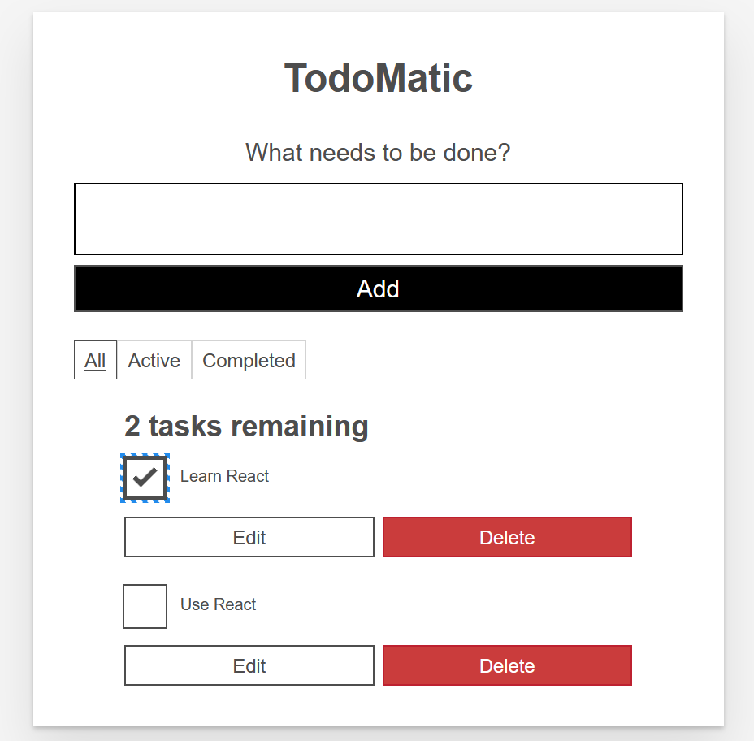

# ToDoList_React

Tutorial for creating a To Do App with React

## Prerequisites

Before you begin, ensure you have the following installed:

- Node.js: [Download & Install Node.js](https://nodejs.org/)

## Features

This To-Do App application includes the following features:

- Read a list of tasks
- Add a task using the mouse or keyboard
- Mark any task as completed, using the mouse or keyboard
- Delete any task, using the mouse or keyboard
- Edit any task, using the mouse or keyboard
- View a specific subset of tasks: All tasks, only active tasks, or only completed tasks

## Screenshots

Here are some screenshots of the React To-Do List application:

*Screenshot*

